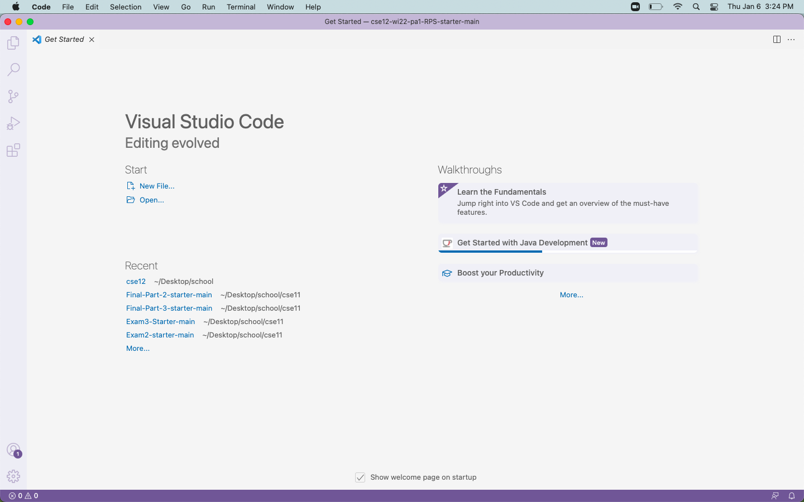

# Lab Report 1
## How To Log Into a Course-Specific Account On `ieng6`. 

&nbsp; 

**Step 1:** Installing VS Code

The first and initial step you need to take to log into a course-specific account on ieng6 consists of downloading a code editor, specifically Visual Studio Code. This can be done through clicking on the following link to the Visual Studio Code website:  https://code.visualstudio.com/. There are several different versions to download depending on the operating system that you are using. 

Once you have VS Code installed, this window should be displayed on your screen. Depending on the version you’ve installed or the appearance settings/theme you have, your window might look slightly different but it should still look relatively similar to this: 



&nbsp; 

**Step 2:** Remotely Connecting

Depending on the operating system you have, you may need to download a program before attempting this step. For Windows users, you will need to download OpenSSH through this following link: https://docs.microsoft.com/en-us/windows-server/administration/openssh/openssh_install_firstuse. For Mac users, you aren’t required to install this.  

To start, you will need to look up your course-specific account for CSE 15L through this link: https://sdacs.ucsd.edu/~icc/index.php. Make sure to write down the last two digits of your account name as you will need this to log into a course-specific account on ieng6. 

Then, open up the terminal on VS code either through the menu bar or by the Ctrl/Command + ` keyboard shortcut and begin typing the following command into the terminal. 

```
$ ssh cs15lwi22zz@ieng6.ucsd.edu
```

Before you click enter, replace the ‘zz’ portion of the command with the two digits you wrote down after looking up your account in the previous step. 
