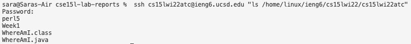

# Lab Report 1:
## How To Log Into a Course-Specific Account On `ieng6`. 

  

**Step 1:** Installing VS Code

Hello and welcome to a tutorial on how to log into a course-specific account on `ieng6`!

The first step you need to take consists of downloading Visual Studio Code, a code editor. This can be done through clicking on the following link to the Visual Studio Code website:  [https://code.visualstudio.com/](https://code.visualstudio.com/). Make sure to download the version that suits the operating system that you are using! 

Once you have VS Code installed, this window should be displayed on your screen. The colors might look a little different, however, your window should look relatively similar to this: 


  

**Step 2:** Remotely Connecting

For this step, Windows users need to download OpenSSH through this following link: [Download OpenSSH](https://docs.microsoft.com/en-us/windows-server/administration/openssh/openssh_install_firstuse). For Mac users, you aren’t required to install this.  

To start, you will need to look up your course-specific account for CSE 15L through this link: [https://sdacs.ucsd.edu/~icc/index.php](https://sdacs.ucsd.edu/~icc/index.php). Make sure to write down the last three digits of your account name as you will need this to log into a course-specific account on `ieng6`! 

Then, open the terminal on VS code either through the menu bar or by the Ctrl/Command + ` keyboard shortcut and type the following command into the terminal: 

```
$ ssh cs15lwi22abc@ieng6.ucsd.edu
```

Before you click enter, replace the 'abc' portion of the command with the three digits you wrote down after looking up your account in the previous step. 

If this is the first time you connect to the server, you might receive a message like this in the terminal as I did for my first time connecting: 


Simply type 'yes' and then enter your password when you are prompted to.

After you've typed your password, your terminal should look like this:


This means that you've officially remotely connected to a computer in the CSE basement and that you're ready to perform some fun commands! Woo!

  

**Step 3:** Trying some commands

After you've remotely connected, there are some helpful commands that you can run on the remote computer. 

You can try the following:
* `cd` : changes directory
* `cd ~` : navigates to home directory
* `ls -lat` : lists files in directory along with hidden files
* `mkdir <name>` : makes a new directory/folder
* `pwd` : prints working directory

This following image shows what running the previous commands on the remote computer might look like in the terminal:


You can also try these commands on your own computer if you'd like.  

&nbsp; 

**Step 4:** Moving Files with `scp`

After running some commands, now you can attempt to copy a file from your computer over to the remote computer with the command `scp`. This command will be run from the client, meaning that you won't need to log into `ieng6` and instead will do it directly from your computer. 

If you're still logged into the remote computer, your first step will be to log out by clicking Ctrl+D or running the command `exit`.

Then, run the file you wish to move to the remote computer on your computer first, to double check there are no errors and that everything works. Afterwards, run the following command in the terminal using your special three digit numbers at the end of your username:

```
$ scp <filename>.java cs15lwi22abc@ieng6.ucsd.edu:~/
```

As an example, your terminal should look like this after doing the previous steps:


After running the command, you should be prompted to enter your password. Once you've entered your password, you may log into the `ieng6` server again through using `ssh` and your username. Use the command `ls` on the remote computer, and you will see that the file from your computer has now transferred over to the remote computer! 

This is what logging back into the `ieng6` server and running `ls` looks like: 


&nbsp; 

**Step 5:** Setting an SSH Key

Now that you know how to move files over using the `scp` command, you will realize that this process takes longer than it should because of the repetitive prompt to enter your password. 

That is where the importance of setting an `ssh` key comes from. This step will be done using `ssh-keygen` which is a program that generates a public key and private key. You need to copy the public key to a location on the remote computer and store the private key on a location on the client server so the `ssh` command will no longer prompt you to enter your password again. 

First, run the following command on your computer (not `ieng6`):

```
$ ssh-keygen
```

You will be asked to enter a location where to copy the file. You should simply copy and paste the suggested location that is given to you in parenthesis, like in this image:


Press the enter space twice for the following inputs and then copy the location of the public key given to you in the terminal. 


Afterwards, log back into the remote server using `ssh` and your username. Enter your password and then use the following command:

```
$ mkdir .ssh
```

Then, log out of the server by typing `exit`. Now that you're back on the client server, enter this additional command in order to copy the public key to the `.ssh` directory of your user on the `ieng6` server:

```
scp <path you were given in the above command> <username>:~/.ssh/authorized_keys
```

As an example, it should look similar to this: 


Now the next time you use `ssh` or `scp`, you don't need to enter your password! :)

&nbsp; 

**Step 6:** Optimizing Remote Running

To optimize remote running further, there are several ways one can use commands to make edits to a certain file or perform a certain action more efficiently or effectively. 

For example, if you wish to log into the remote server and run a single command all at once in one line, you are able to type the following: 

```
$ ssh cs15lwi22zz@ieng6.ucsd.edu "ls <directory>"
```

An example of running this command can be seen in the following image: 



This command allows you to log into the remote server, run a certain command typed within  quotation marks, and then immediately log out afterwards which saves a lot of time and energy. 

Another way to optimize remote running is to write multiple lines of codes in one line, separated by semi-colons which would look like this:

```
$ cp <FileName>.java; javac <FileName>.java; java <ClassName>
```

Combining several lines of code together into one line is much more efficient and effective than taking the time to run each portion individually. 

And that concludes the tutorial on how to log into a course-specific account on `ieng6`, run some commands, move files with `scp` and set an SSH key! 
