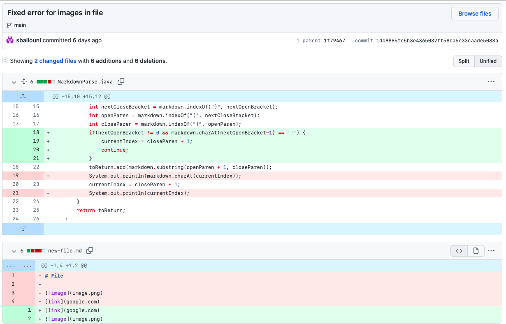
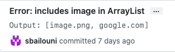
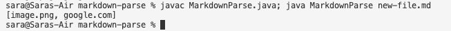
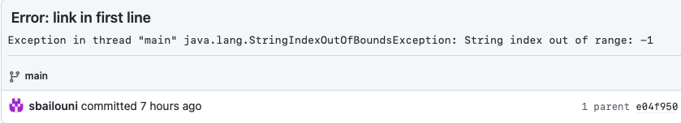
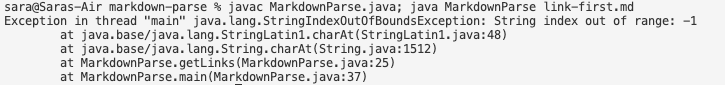
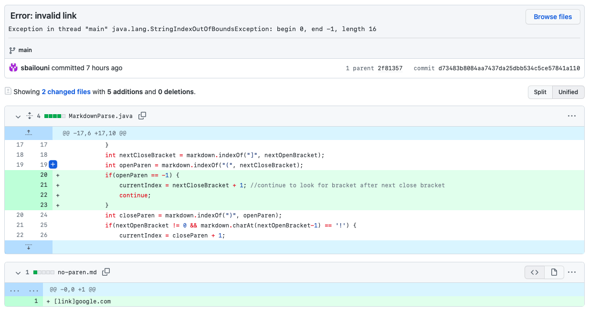
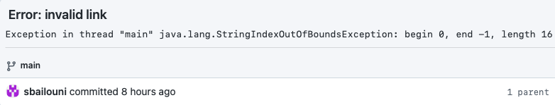
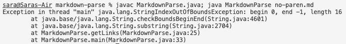

# Lab Report 2

## **Code Change 1:** Image in ArrayList

Screenshot of Github code change:

Link to the test file: [new-file.md](https://github.com/sbailouni/markdown-parse/blob/72413d01f8421d1c198b69984f74f9d70118e736/new-file.md)

Symptom of failure-inducing input in commit message history: 

Symptom of failure-inducing input in terminal: 

Description:

In this code change, the failure-inducing input was a test file that included a link/address of an image. This test file caused a bug within the program that has a symptom which produced an incorrect output. This output included the link/address of the image which is incorrect because the purpose of the program is to only produce links of websites and not images. 

&nbsp; 

## **Code Change 2:** Link in First Line

Screenshot of Github code change:

Link to the test file: [link-first.md](https://github.com/sbailouni/markdown-parse/blob/61116f61acee495b1a6dea4c003b46f40e083a10/link-first.md)

Symptom of failure-inducing input in commit message history: 

Symptom of failure-inducing input in terminal: 

Description:

In this code change, the failure-inducing input was a test file that included a link in the first line of the file, without any headers at the top of the file. This test file resulted in a bug with a symptom that causes the program to produce an Index Out of Bounds Exception. Despite there being a valid link, the program was unable to print it out correctly which hinted that there was something wrong with the code that triggered the exception.

&nbsp; 

## **Code Change 3:** Invalid Link in Output

Screenshot of Github code change: 

Link to the test file: [no-paren.md](https://github.com/sbailouni/markdown-parse/blob/d73483b8084aa7437da25dbb534c5ce57841a110/no-paren.md)

Symptom of failure-inducing input in commit message history: 

Symptom of failure-inducing input in terminal: 

 

Description:

In this code change, the failure-inducing input was a test file that included an invalid link that doesn't include any parentheses, only brackets. This resulted in a bug that had a symptom which caused the program to produce an Index Out Of Bounds Exception when ran with the input. This shouldn't have occured since the expected output would've been an empty ArrayList if an invalid link was input into the program, meaning that the code needs to be changed in order to produce the correct output.  