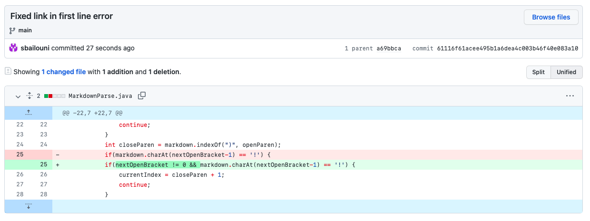

# Lab Report 2

## **Code Change 1:** Image in ArrayList

Screenshot of Github code change:

Link to the test file: [new-file.md](https://github.com/sbailouni/markdown-parse/blob/72413d01f8421d1c198b69984f74f9d70118e736/new-file.md)

Symptom of failure-inducing input in commit message history: 

Symptom of failure-inducing input in terminal: 

Description:

In this code change, the failure-inducing input was a test file that included a link/address of an image. This test file caused a bug within the program that has a symptom which produced an incorrect output. This output included the link/address of the image which is incorrect because the purpose of the program is to only produce links of websites and not images. 

The reason why the program before the change had outputted the bug was because it counted each open and closed bracket, followed by an open and closed parenthesis within the markdown file without checking if there's an exclamation mark before it (which there was in this case) that would identify it as an image and not a link. Thus, we added an `if` statement that checked for the exclamation point at the index previous to the `nextOpenBracket` and then changed the `currentIndex` so that the program can differentiate between the two and run correctly. 

&nbsp; 

## **Code Change 2:** Link in First Line

Screenshot of Github code change:

Link to the test file: [link-first.md](https://github.com/sbailouni/markdown-parse/blob/61116f61acee495b1a6dea4c003b46f40e083a10/link-first.md)

Symptom of failure-inducing input in commit message history: 

Symptom of failure-inducing input in terminal: 

Description:

In this code change, the failure-inducing input was a test file that included a link in the first line of the file, without any headers at the top of the file. This test file resulted in a bug with a symptom that causes the program to produce an Index Out of Bounds Exception. Despite there being a valid link, the program was unable to print it out correctly which hinted that there was something wrong with the code that triggered the exception.

The reason why the program before the change had outputted the bug was because of the `if` statement that we wrote in the last code change. It checks for the index that is 1 less than `nextOpenBracket`, however, since the `nextOpenBracket` is 0 in this case, it tries to access a negative index which triggers the Index Out Of Bounds exception. To fix this bug, we added an additional condition in the same `if` statement that checks if `nextOpenBracket` is not equal to zero. This fixed the program and it was working correctly again. 

&nbsp; 

## **Code Change 3:** Invalid Link in Output

Screenshot of Github code change: 

Link to the test file: [no-paren.md](https://github.com/sbailouni/markdown-parse/blob/d73483b8084aa7437da25dbb534c5ce57841a110/no-paren.md)

Symptom of failure-inducing input in commit message history: 

Symptom of failure-inducing input in terminal: 

 

Description:

In this code change, the failure-inducing input was a test file that included an invalid link that doesn't include any parentheses, only brackets. This resulted in a bug that had a symptom which caused the program to produce an Index Out Of Bounds Exception when ran with the input. This shouldn't have occured since the expected output would've been an empty ArrayList if an invalid link was input into the program, meaning that the code needs to be changed in order to produce the correct output.  

The reason why the program before the change had outputted the bug was because the `indexOf()` method returned -1 since the program couldn't find the parentheses after the brackets. This caused the substring output to be from 0 and -1 which isn't possible and eventually triggered the Index Out Of Bounds Exception. To fix this, we added an `if` statement that checks if `openParen` is -1, then the `currentIndex` would be changed to the `nextCloseBracket` plus 1. This would allow the program to continue on with the loop to check for other valid links in the file if there are any. 