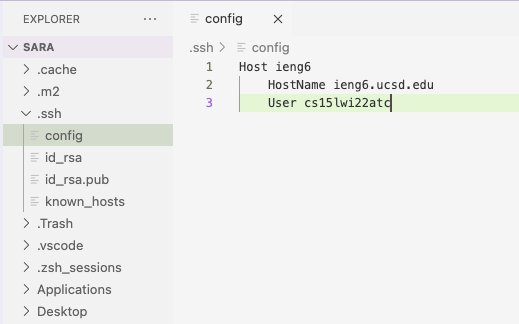
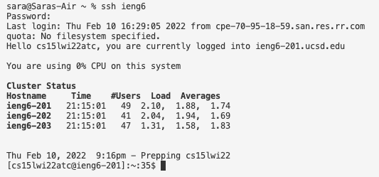
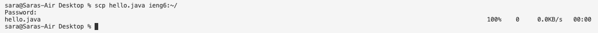
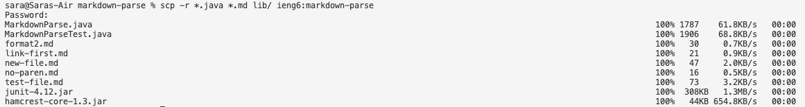

# Lab Report 3
## Streamlining `ssh` Configuration

&nbsp; 

### **Step 1:** Creating `~/.ssh/config`

In order to tell SSH username to use when logging into specific servers, we need to put an entry to `~/.ssh/config`. The first step consists of opening `~/.ssh/config` on your computer. If you don't already have it, then you need to create it by typing the following commands:

```
$ touch ~/.ssh/config
```

```
$ chmod 600 ~/.ssh/config
```

Afterwards, you may see that when you try to access `~/.ssh/config`, it gives an `zsh: permission denied` (at least it did in my case). To work around this, you can type the following command:

```
$ chmod +x ~/.ssh/config
```

&nbsp; 

### **Step 2:** Editing the `config` file

Now, open the `config` file on your code editor and paste the following lines: 

```
Host ieng6
    HostName ieng6.ucsd.edu
    User cs15lwi22zzz (replace the 'zzz' with your username)
```
I used VS Code to edit the file, which looked a little something like this:



Then, try the following command in the terminal and type in your password when prompted:

```
$ ssh ieng6
```

If it ran correctly, it should look like this in the terminal:



This shows that you've successfully logged into the terminal without the need to fully type out your username!

&nbsp; 

### **Step 3:** Using the alias with a `scp` command

Now, the next step is to copy a file to your account using the newly created alias with a `scp` command. You would replace your username with the alias and then enter your password when prompted. This is what the original command with the full username would be:

```
$ scp file.java cs15lwi22zzz@ieng6.ucsd.edu:~/
```

To use the alias, replace `cs15lwi22zzz` with `ieng6` like this:
```
$ scp file.java ieng6:~/
```

This is an image of a similar command ran in the terminal:



In addition, you can also use this alias when copying whole directories using `scp -r`:




