# Lab Report 4

## Personal Implementation

[Repository link to personal implementation](https://github.com/sbailouni/markdown-parse)

### Snippet 1: 

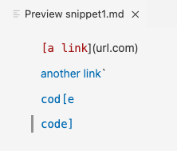

According to the VS Code preview, the expected output that should be produced is the links *'google.com*, *google.com*, and *ucsd.edu*. 

This is a screenshot of the first snippet turned into a test in `MarkdownParseTest.java`:

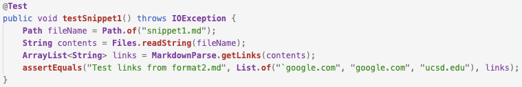

This is the corresponding output of the test when ran in the terminal for my implementation which failed to pass:

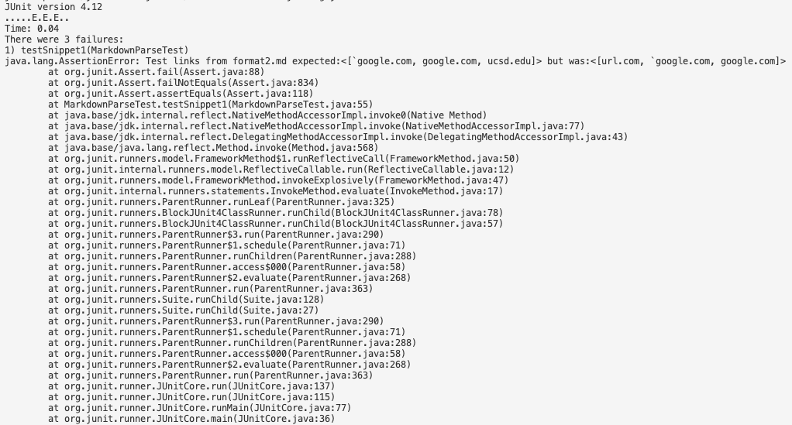

The reason this program failed with this snippet is because it only checks for the opening and closing brackets without checking for any cases where two backtick may be present that will make the link invalid, which was in the case for the url.com link. Additionally, the program was unable to recognize the ucsd.edu link because of the extra closing bracket within the title of the link. However, in order to make the code work for both these cases, it would require more than 10 lines of code. You would first need to add variables which check for an opening backtick and a closing backtick, and if a closing backtick is present, then the link won't be included. In addition, for the ucsd.edu case to pass, you would need to add an if-statement that checks if there’s an open bracket between the last closing bracket of the previous link and the closing bracket subsequent to it. 

### Snippet 2:

According to the VS Code preview, the expected output that should be produced is the links *a.com*, *a.com(())*, and *example.com*. 

This is a screenshot of the first snippet turned into a test in `MarkdownParseTest.java`:

This is the corresponding output of the test when ran in the terminal for my implementation which failed to pass as well:

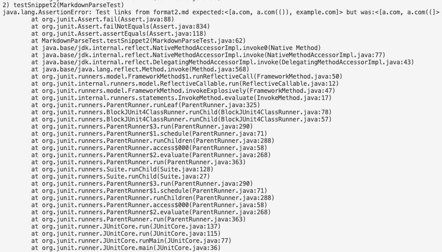

In regards to fixing the program so it works with snippet 2, I think it's possible to fix this error under 10 lines of code. You would need to add an if-statement within the while loop that checks if the closeParen is equal to the length of markdown, which would change the value of closeParen to -1 if the condition passes. This isn't the best solution to the problem, however, it would ultimately make the test pass and produce the correct output with snippet 2 in under 10 lines of code. 

### Snippet 3: 

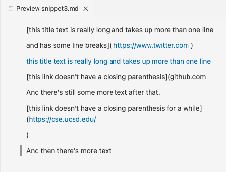

According to the VS Code preview, the expected output that should be produced is the link *https://ucsd-cse15l-w22.github.io/*. 

This is a screenshot of the first snippet turned into a test in `MarkdownParseTest.java`:

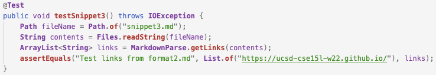

This is the corresponding output of the test when ran in the terminal for my implementation which failed to pass:

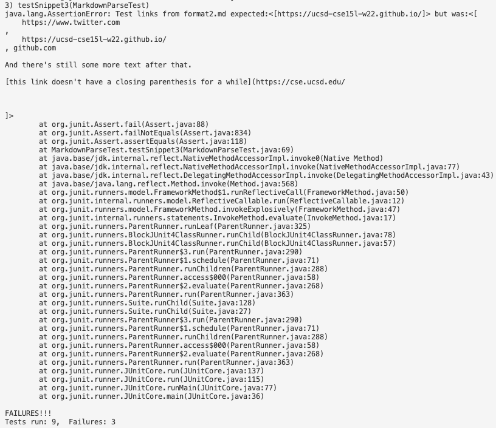

This test failed for snippet 3 because it was taking in account the cases of links with newlines. Fixing it can be done in under 10 lines of code by adding splitting the string into an array and then use newlines along with white spaces as separators, preserving only the first element in the array as the contents of the link. Doing this would ultimately take away the text and contents following the whitespace that would be detected and return the link that is needed. 

## Other Group's Implementation

[Repository link to other implementation](https://github.com/johnsonli010801/markdown-parse)

This is the image of the three tests of the snippets in `MarkdownParseTest.java`: 

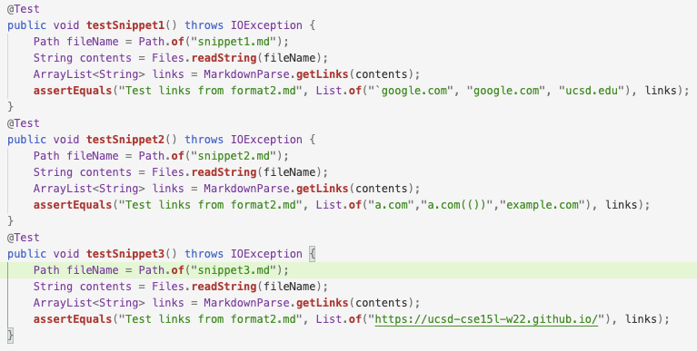

### Snippet 1:

This is the image of the JUnit output for Snippet 1 in the terminal when tested on the other group's implementation, which failed to pass:

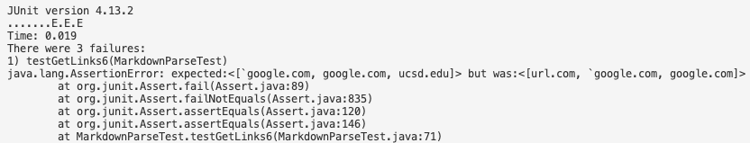 

### Snippet 2:

This is the image of the JUnit output for Snippet 2 in the terminal when tested on the other group's implementation, which failed to pass:

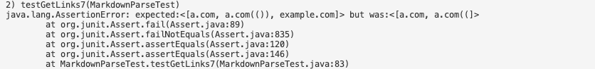

### Snippet 3:

This is the image of the JUnit output for Snippet 3 in the terminal when tested on the other group's implementation, which failed to pass:

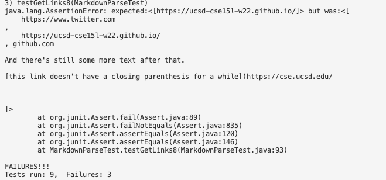

