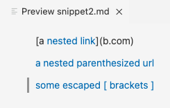
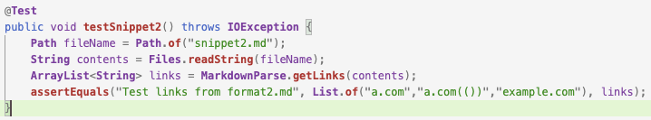

# Lab Report 4

## Personal Implementation

[Repository link to personal implementation](https://github.com/sbailouni/markdown-parse)

### Snippet 1: 

According to the VS Code preview, the expected output that should be produced is the links *'google.com*, *google.com*, and *ucsd.edu*. 

This is a screenshot of the first snippet turned into a test in `MarkdownParseTest.java`:

This is the corresponding output of the test when ran in the terminal for my implementation which failed to pass:

### Snippet 2:

According to the VS Code preview, the expected output that should be produced is the links *a.com*, *a.com(())*, and *example.com*. 

This is a screenshot of the first snippet turned into a test in `MarkdownParseTest.java`:

This is the corresponding output of the test when ran in the terminal for my implementation which failed to pass as well:

### Snippet 3: 

According to the VS Code preview, the expected output that should be produced is the link *https://ucsd-cse15l-w22.github.io/*. 

This is a screenshot of the first snippet turned into a test in `MarkdownParseTest.java`:

This is the corresponding output of the test when ran in the terminal for my implementation which failed to pass:

## Other Group's Implementation

[Repository link to other implementation](https://github.com/johnsonli010801/markdown-parse)

This is the image of the three tests of the snippets in `MarkdownParseTest.java`: 

### Snippet 1:

This is the image of the JUnit output for Snippet 1 in the terminal when tested on the other group's implementation, which failed to pass:

 

### Snippet 2:

This is the image of the JUnit output for Snippet 2 in the terminal when tested on the other group's implementation, which failed to pass:

### Snippet 3:

This is the image of the JUnit output for Snippet 3 in the terminal when tested on the other group's implementation, which failed to pass:

