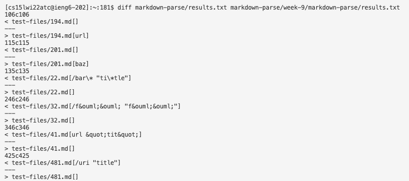
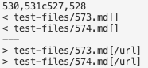
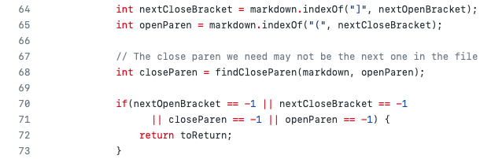
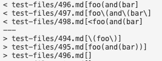
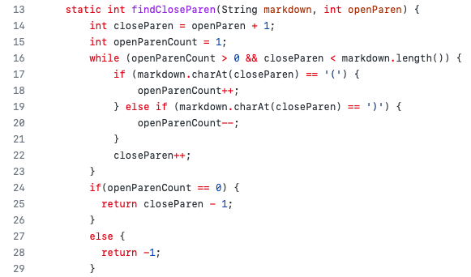
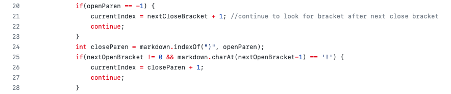

# Lab Report 5

## **Test File 1:** 573.md

573.md file content:

```
](/url2)
```

For this test, the correct output should be an empty ArrayList with no links because the exclamation mark behind the open bracket makes it an invalid link. 

To find the differences between the two implementations of markdown parse, I used `diff` on the results.txt files of both our implementation and the one provided for lab 9 using the following command in the terminal on the remote server:

```
diff markdown-parse/results.txt week-9/markdown-parse/results.txt
```

The first is our lab group's implementation and the second is the implementation we looked over in Week 9.

This was done by combining the results into a results.txt file for both implementations and using `script.sh` as such:

```
bash script.sh > results.txt
```

This is what part of the output looked like when running `diff` in the terminal:



Specifically for test file `573.md`, this was the output for my lab group's implementation:

```
< test-files/573.md[]
```

On the other hand, this was the output for the implementation from lab 9:

```
> test-files/573.md[/url]
```

This is a screenshot of the specific output differences in terminal:



The correct implementation for this file is our lab group's implementation because it resulted in the expected output, which was an empty ArrayList, compared to the implementation provided from lab 9 which resulted in an ArrayList including the string `/url`. 

The problem in the code provided from lab 9 is that it doesn't check for cases where an exclamation mark might be present before an open bracket which is why `/url` was considered a link and got added to the ArrayList.



In the code snippet above (from the `getLinks` method), there are no if-statements present that check if the index before the `nextOpenBracket` contains the `!` symbol. In order to fix this bug, the following code needs to be added after assigning `closeParen` in line 68:

```
if(markdown.charAt(nextOpenBracket-1) == '!') {
    currentIndex = closeParen + 1;
    continue;
}
```

## **Test File 2:** 496.md

496.md file content:

```
[link](foo(and(bar))
```

Test outputs:



This was the output for my lab group's implementation:

```
< test-files/496.md[foo(and(bar]
```

Conversely, this was the output for the implementation from lab 9:

```
> test-files/496.md[]
```

The correct implementation for this test is the implementation from lab 9 because based on Common Mark demo site, `[link](foo(and(bar))` isn't a valid link and thus the expected output should be an empty ArrayList, which was the case for the implementation from lab 9. However, for my lab group's implementation, the actual output produced an ArrayList with the string `foo(and(bar`. 

The problem in the code from our implementation is that it doesn't check for cases where there may be a closing parenthesis after the first one encountered, which can possibly make the link invalid. The reason why the implementation from lab 9 passes this test is because it implements a method called `findCloseParen()` that checks for 
a valid closeParen:



To fix the bug for our implementation, we can implement a similar method to `findCloseParen()` and call the method on line 24, removing the code where we assign the first instance of `closeParen` without checking if the link is valid, as seen in the image below:


 
Thank you for reviewing the lab report! :-)
